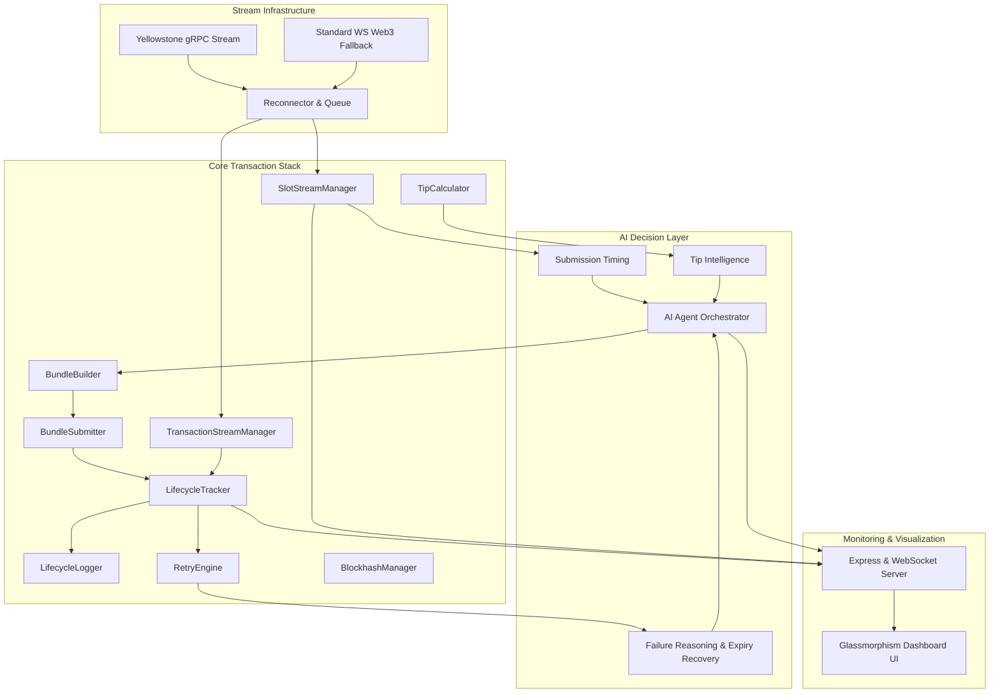
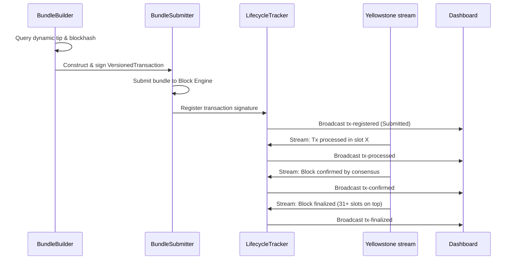
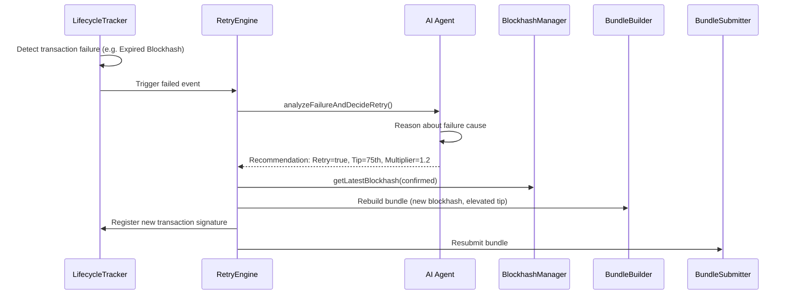

# Solana Smart Transaction Stack — System Architecture

This document describes the high-level system architecture, component breakdowns, data flows, and design decisions for the **Solana Smart Transaction Stack** submission.

---

## 1. System Overview

The stack is a modular, high-throughput transaction submission engine designed to construct Jito bundles, track transaction lifecycles in real-time using Yellowstone gRPC streaming, and apply artificial intelligence to operational decisions.

---

## 2. Core Components

### A. Stream Infrastructure
- **`SlotStreamManager`**: Connects to the Yellowstone gRPC endpoint. Subscribes to slots at processed, confirmed, and finalized levels to track block progress and leader rotations. Falls back to standard WebSocket updates if gRPC is unavailable.
- **`TransactionStreamManager`**: Listens for transaction status confirmations. It monitors transaction commitment level changes (Submitted → Processed → Confirmed → Finalized) in real-time.

### B. Bundle Management
- **`TipCalculator`**: Dynamically queries the Jito block engine's `getTipFloor` RPC method to retrieve landed tip distribution percentiles.
- **`BundleBuilder`**: Assembles a `VersionedTransaction` and appends a transfer instruction targeting one of Jito's 8 public tip accounts.
- **`BundleSubmitter`**: Sends base64-encoded bundles to the block engine via JSON-RPC.

### C. Lifecycle & Recovery
- **`LifecycleTracker`**: Acts as an in-memory coordinator calculating delta times between execution phases.
- **`LifecycleLogger`**: Appends telemetry to a structured JSON file (`logs/lifecycle-log.json`).
- **`RetryEngine`**: Automatically retries dropped/failed transactions.
- **`BlockhashManager`**: Fetches blockhashes using `confirmed` commitment level to maximize remaining lifecycle.

### D. AI Decision Layer
- **`AIAgent`**: Orchestrates operational decisions.
  - **Timing Intelligence**: submission schedules based on Jito slot distance.
  - **Tip Intelligence**: Adjusts tip percentiles and multipliers based on congestion.
  - **Failure Reasoning & Recovery**: Inspects error types (e.g. `EXPIRED_BLOCKHASH`) to adjust gas/tip params and trigger autonomous refreshes and resubmissions.

---

## 3. Detailed Data Flow

### Normal Transaction Flow

### AI Failure Recovery Flow (Fault Injection)

---

## 4. Key Design Decisions

1. **Rule-Based Fallback for AI Reasoning**: To guarantee execution without API key errors, the AI agent carries a deterministic fallback decision engine that mimics LLM outputs.
2. **Mainnet-Simulation Hybrid**: To allow testing without burning real SOL on bundles, a toggle (`SIMULATE_TRANSACTIONS=true`) simulates slot progression and bundle landing while using production interfaces.
3. **Confirmed Commitment for Blockhash**: Fetches blockhashes using `confirmed` commitment. This guarantees that blockhashes have 150 slots of lifetime (minus network delay), avoiding the slot loss typical of `finalized` commitment.
